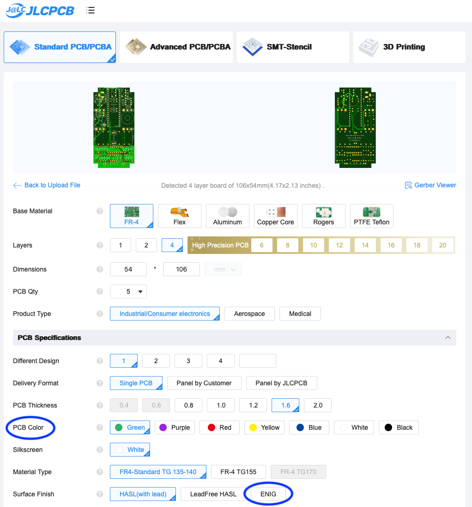
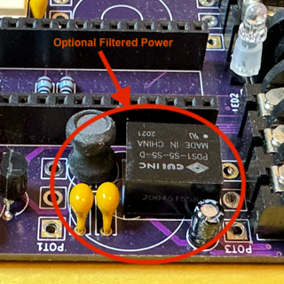
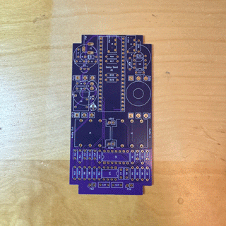
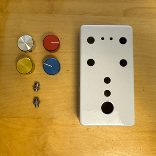

# Building the Hardware
Some quick instructions for how to make the GuitarPedal1590B Hardware.  This document assumes you know the basics about soldering and circuit board assembly.

Quick note, I couldn't include some of the custom footprints for specific components due to licenses that wouldn't allow redistribution.  Here is a list of where you can find some of them:

* PDS1-S5-S5-D - https://www.cui.com/product/dc-dc-converters/isolated/pds1-d-series (click on "all models" for downloadable footprints)
* Neutrik NMJ6HCD2 - https://www.snapeda.com/parts/NMJ6HCD2/Neutrik/view-part/
* PJ-320A - Footprint and STEP Model found on this repository https://github.com/keebio/Keebio-Parts.pretty

Also, I just want to acknowledge that the schematics for the circuits were kit bashed together from the following sources with some additions of my own:

* [Electro-Smith: Daisy Petal Rev 5 Schematics](https://github.com/electro-smith/Hardware/blob/master/reference/daisy_petal/ES_Daisy_Petal_Rev5.pdf)
* [Simple DIY Electronic Music Projects](https://diyelectromusic.wordpress.com/2022/08/29/3v3-midi-module-pcb/)

Getting everything into KiCad and the PCB layouts are all my own work.

## 1. Order the PCBs

The KiCad files are included for the full schematic and pcb board layout in the **pcb** folder.  You really don't need to know anything about KiCad to order the PCB and get it made, but they are there for reference.

I like to order my PCBs from https://www.jlcpcb.com, but anywhere should work fine.

Follow these steps to get the PCB made by JLCPCB:

1. Download the ready-made [JLCPCB Gerber Files](../pcb/JLCPCB-Gerbers/DaisySeedPedal1590b-Rev6-gerbers.zip) for this project to your computer. (Keep the files zipped)
2. Visit the [JLCPCB Website](https://www.jlcpcb.com).
3. Click the **Order Now** button in the top menu bar.
4. Click the **Add Gerber File** button. 
5. Upload the zipped Gerber files you downloaded above.
6. After processing the files it should provide a screen with various options. Everything is fine by default, but you may want to change the color of the board and I like to use ENIG finishing options instead of HASL, but this is up to you. 
7. Add the item to your cart, and order the PCB.

They will give you a price for ordering 5 pcbs (that's their minimum order).  I think I paid ~$50 for a Purple board with ENIG (this is a more expensive option).  It will take a week or two for it arrive and they look like this:

## 2. Source the Components

A full list of all the required components can be found in the [Bill_of_Materials_BOM.xlsx](Bill_of_Materials_BOM.xlsx) file.  Everything uses Through-Hole type components for simplicity sake. You can omit components C6, L1, and U2 if you don't want to use the optional filtered power section of the schematic.

## 3. Solder Everything

I like to solder in the following order for simplicy:

1. All Resistors
2. Diodes - D1 & D2
3. MLCC Capacitors - 10uF - C1, C4, C9, C10, C11, C12, C15, C16
4. (*Optional) MLCC Capacitor - 10uF - C5
5. Film Capacitors - 100nF - C2, C3, C7, C8, C13, C14
6. Ceramic Capacitor - 100nf - C17
7. LDO - 5V Linear Voltage Regular - U1
8. ICs - U3,U4,U5
9. Jacks - J1, J2, J3, J4, J5
10. 20 Pin Headers (x2) - A1
11. 3mm LEDs - LED1 & LED2 - You'll want to keep the legs long possibly using a 10mm spacer from the PCB, Short pin goes to the square pad!

Optional Filtered Power Supply:

This circuit board supports an optional filtered power supply section. If you plan to connect this pedal to a high quality isolated power source, this step is not necessary, and you can omit C6, L1, and U2. Otherwise, it's probably a good idea to do. You can add it later if you like, but you'll have to remove the Pot that this stuff sits under...

12. (*Optional) Electrolytic Capacitor - 22uF - C6
13. (*Optional) Inductor - 2.2 uH - L1
14. (*Optional) - Isolated Power Converter - U2

It looks like this image (perhaps slight change in placement of parts) if you do include this option. Leave R21 un-bridged.

If you don't plan to filter the power, you must bridge the contacts on R21 with solder as shown in this image.

Finally:

15. All Pots
16. All Footswitches

It goes a little something like this:

(I omitted the 2nd foot switch from my build)

## 4. Order the Enclosure and External Hardware

You'll also need to order an enclosure and the external hardware such as the knobs and the Led Holders.

You can either order a generic 1590B sized enclosure like these from [Tayda](https://www.taydaelectronics.com/hardware/enclosures/1590b-style.html) and drill your own holes (which is a pain in the butt), or you can order a custom drilled & powder coated enclosure from Tayda using this [Custom Drill Template](https://drill.taydakits.com/box-designs/new?public_key=YWRhVFFGU0Z2c3RJR09VQ1U4S3EvUT09Cg==)

Additional External Hardware:

1. 4 Knobs for the POTS.  These are the ones I used in various colors from [Tayda](https://www.taydaelectronics.com/knurled-aluminum-yellow-knob-2845.html)
2. 2 Led Holders (for the enclosure). These are the ones I used from [Amazon](https://www.amazon.com/gp/product/B083Q9QMN4)

## 5. Flash the Software to the Daisy Seed on the Hardware

Before you attempt to get everything fitted into the enclosure, it's best to make sure all the hardware works.

Install the Daisy Seed into the headers on the PCB.

You'll need to compile the code and flash it into the Daisy Seed on the hardware. Instructions can be found [here](../../../Software/GuitarPedal/README.md).

## 6. Jam everything into the enclosure, and ENJOY!

You'll want to use the LED Holders on on the enclosure and use the washers and nuts that came with the Pots and Encoder to secure them to the enclosure.

